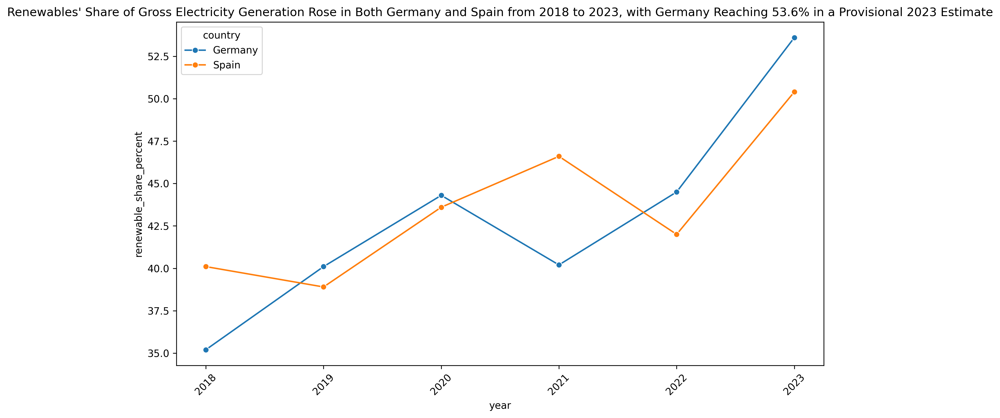
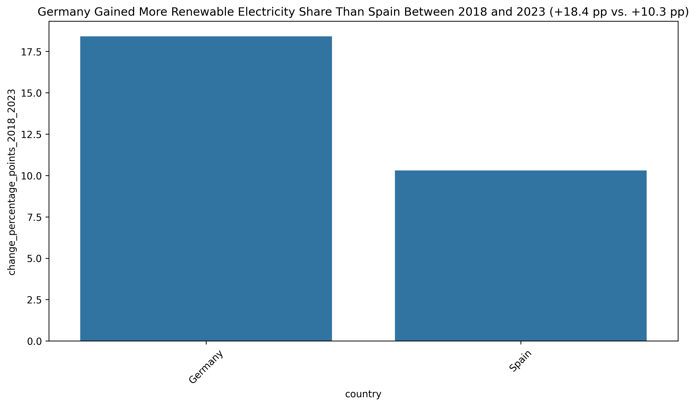

# Renewables share in total (gross) electricity generation — Germany & Spain (2018–2023)

## Executive summary

- This report answers: How has the share of renewable energy in total (gross) electricity generation changed from 2018 to 2023 in Germany and Spain?
- Metric used: share of renewables in total (gross/brutto) electricity generation (%) = (renewable generation / total gross generation) × 100. Where national sources report a different basis (e.g., public net), I use the national _gross_ series and note basis differences.
- Main result (2018 → 2023, national primary sources):
  - **Germany:** 35.2% → 53.6% = **+18.4 percentage points (pp)** (Germany 2023 value flagged PROVISIONAL by the national compiler). Source: AG Energiebilanzen (STRERZ).
  - **Spain:** 40.1% → 50.4% = **+10.3 pp** (Spain 2023 final consolidated value per REE).
- Data provenance: Germany primary = AG Energiebilanzen STRERZ tables (bruttostromerzeugung); Spain primary = Red Eléctrica de España (REE) annual/system reports and consolidated figures. Cross-checks: Fraunhofer ISE Energy‑Charts (DE public-net), Eurostat SHARES (harmonised), Ember (EU context). See full citations below.
- Charts: two plots created from the validated annual series are included in the report (time series 2018–2023 and a bar of total change). Germany 2023 is annotated as provisional on the charts.

---

# Detailed findings (main topic)

## Annual values (2018–2023)

Metric: share of renewables in total gross electricity generation (%) as reported by national primary sources.

| Year | Germany (% renewables of gross generation) | Source (provisional?)                               | Spain (% renewables of gross generation) | Source (provisional?)                       |
| ---- | -----------------------------------------: | --------------------------------------------------- | ---------------------------------------: | ------------------------------------------- |
| 2018 |                                      35.2% | AG Energiebilanzen — STRERZ (final)                 |                                    40.1% | REE — Informe 2018 (final)                  |
| 2019 |                                      40.1% | AG Energiebilanzen — STRERZ (final)                 |                                    38.9% | REE — Informe 2019 (final)                  |
| 2020 |                                      44.3% | AG Energiebilanzen — STRERZ (final)                 |                                    43.6% | REE — year‑end press/report (final)         |
| 2021 |                                      40.2% | AG Energiebilanzen — STRERZ (final)                 |                                    46.6% | REE — year‑end press/report (final)         |
| 2022 |                                      44.5% | AG Energiebilanzen — STRERZ (final)                 |                                    42.0% | REE — system report (final)                 |
| 2023 |                                  **53.6%** | AG Energiebilanzen — STRERZ (PROVISIONAL; see note) |                                **50.4%** | REE — consolidated annual reporting (final) |

Notes:

- Germany 2023 (53.6%) is reported in AG Energiebilanzen STRERZ tables published Feb 2024 but AG Energiebilanzen explicitly flags latest-year values as potentially preliminary; hence the Germany 2023 datapoint is marked **PROVISIONAL**. Source: AG Energiebilanzen STRERZ_Abg_02_2024_korr.pdf.
- Spain 2023: REE issued a preliminary 50.8% (Dec 2023) and later published consolidated annual tables; the consolidated final value used here is **50.4%** (REE consolidated reporting). REE is the authoritative national TSO source for the peninsular system.

## Total change 2018 → 2023 (percentage points)

- Germany: `53.6% − 35.2% = +18.4 pp` (AG Energiebilanzen — 2023 provisional).
- Spain: `50.4% − 40.1% = +10.3 pp` (REE consolidated final).

## Visualization

- Time series (2018–2023) for Germany and Spain (national-primary series). Germany 2023 point is annotated as provisional.
  - 
- Bar chart: total change (2018→2023) in percentage points for each country.
  - 

---

# Brief explanation — main drivers of the change

## Germany — reasons for the **+18.4 pp** increase (2018 → 2023)

- Rapid growth in wind (onshore + offshore) and solar PV capacity and generation, particularly high output in 2023, which raised renewable generation volumes. (Sources: AG Energiebilanzen STRERZ; Fraunhofer ISE Energy‑Charts.)
  - AG Energiebilanzen STRERZ tables (generation by technology) and Fraunhofer Energy‑Charts (generation & installed capacity summaries).
- Weather and hydrology in 2023: relatively favourable wind & solar conditions (and month-level variability) increased renewable output in 2023 vs some earlier years. (Source: Fraunhofer ISE Energy‑Charts.)
- Nuclear phase‑out (final reactor shutdowns in April 2023) and lower utilization / shifting patterns in fossil generation contributed to renewables taking a larger share of gross production. (Source: AG Energiebilanzen commentary; Fraunhofer analyses.)
- Policy and market context (EEG framework, auctions, permitting progress; energy crisis responses that reduced gas use and accelerated renewables deployment) supported the growth and changed dispatch patterns. (Sources: AG Energiebilanzen; Ember analyses.)

Key supporting citations (examples):

- AG Energiebilanzen — STRERZ (Bruttostromerzeugung, Anteil EE): https://ag-energiebilanzen.de/wp-content/uploads/2024/04/STRERZ_Abg_02_2024_korr.pdf
- Fraunhofer ISE — Energy‑Charts (Germany public-net monthly/annual summaries): https://energy-charts.info/ (downloadable slides)

## Spain — reasons for the **+10.3 pp** increase (2018 → 2023)

- Strong expansion of solar PV capacity (large annual PV additions 2019–2023) and continued wind deployment — PV was the dominant contributor to incremental renewable generation. (Source: REE annual reports & capacity tables.)
- Hydrology recovery in 2023 (after a drier 2022) plus very strong PV months in 2023 increased renewable generation versus 2022, raising the annual share. (Source: REE monthly/annual reports & press notes.)
- Improved system integration and dispatch (TSO operations, stronger grid integration of renewables) and market/policy drivers (national auctions, permitting acceleration during/after the energy crisis) supported faster deployment and higher utilization of renewables. (Sources: REE; Ember context.)

Key supporting citations (examples):

- Red Eléctrica de España (REE) — main annual/system reports & press: REE press & consolidated pages (Dec 2023 preliminary; later consolidated 2023 reporting). Example REE pages: https://www.ree.es/ (see press 19‑Dec‑2023 and consolidated reporting pages).

---

# Supporting context and cross‑checks (secondary topics)

- Basis & comparability:
  - Germany primary series (used here) = AG Energiebilanzen “Bruttostromerzeugung (ohne PSE)” — gross generation basis. Fraunhofer ISE reports a _public-net_ renewable share (the “mix delivered to the public grid”), which is a different basis and is typically a few percentage points higher than AG Energiebilanzen’s gross figure (example: Fraunhofer public-net ~56.9% for 2023 vs AGEB 53.6% on gross basis). See Fraunhofer Energy‑Charts for the public-net series.
    - Fraunhofer Energy‑Charts (public-net): https://energy-charts.info/
    - AG Energiebilanzen (gross): https://ag-energiebilanzen.de/wp-content/uploads/2024/04/STRERZ_Abg_02_2024_korr.pdf
  - Spain primary series = REE peninsular gross generation (authoritative for peninsular system). Eurostat SHARES (nrg_ind_ren) is the harmonised EU dataset and may differ due to normalisation rules (hydro/wind normalisation under RED rules); use Eurostat when strict harmonised cross-country comparison is required.
    - Eurostat SHARES (nrg_ind_ren): https://ec.europa.eu/eurostat/databrowser/view/nrg_ind_ren/default/table?lang=en

- Monthly/seasonal drivers:
  - Fraunhofer (DE) and REE (ES) daily/monthly datasets show that particular months in 2023 (strong wind months in Germany; strong PV months and hydro recovery in Spain) contributed disproportionately to the annual increases. See the Fraunhofer annual slides and REE monthly/day data for month‑by‑month attributions.
    - Fraunhofer slides (example): downloadable “Stromerzeugung_2023.pdf” via Energy‑Charts downloads.
    - REE daily/monthly data: REE data portal and press notes (records such as high-renewables daily shares in Nov 2023).

- EU/Gas‑crisis context:
  - The 2021–22 gas crisis, REPowerEU and national policy responses accelerated renewables deployment and changed short-term dispatch patterns (reduced gas usage, rapid permitting support). Ember and EC analyses document the continental context for the 2022–2023 changes.
    - REPowerEU (EC): https://energy.ec.europa.eu/
    - Ember — European Electricity Review: https://ember-climate.org/insights/research/european-electricity-review-2024/

---

# Complete source citations (primary + key cross-checks)

- Germany (primary): AG Energiebilanzen — STRERZ_Abg_02_2024_korr.pdf (tables: “Anteil EE an der Bruttostromerzeugung (ohne PSE) [%]”) — https://ag-energiebilanzen.de/wp-content/uploads/2024/04/STRERZ_Abg_02_2024_korr.pdf
- Germany (cross-check): Fraunhofer ISE — Energy‑Charts (public-net generation & slides): https://energy-charts.info/ (downloads: Stromerzeugung_2023.pdf)
- Spain (primary): Red Eléctrica de España (REE) — annual system reports, year‑end press notes and consolidated reporting pages (examples):
  - REE preliminary press (Dec 2023): https://www.ree.es/es/sala-de-prensa/actualidad/nota-de-prensa/2023/12/las-renovables-baten-record-y-generan-mas-de-la-mitad-de-toda-electricidad-espana-en-2023
  - REE consolidated reporting / later reference to final 2023: https://www.ree.es/
- Harmonised cross-check: Eurostat (SHARES / nrg_ind_ren): https://ec.europa.eu/eurostat/databrowser/view/nrg_ind_ren/default/table?lang=en
- Context & analysis: Ember — European Electricity Review (2024): https://ember-climate.org/insights/research/european-electricity-review-2024/
- Policy context: European Commission — REPowerEU / communications on accelerating renewables: https://energy.ec.europa.eu/

(For traceability, the table values and provenance used in this report were taken from the AG Energiebilanzen STRERZ PDF and REE annual/consolidated reporting pages cited above. See those sources for the underlying per-technology TWh tables and downloadable Excel files.)

---

# Key insights and recommendations (actionable)

Insights

- Both countries increased the share of renewables substantially between 2018 and 2023; Germany’s increase (+18.4 pp) was larger in absolute pp terms than Spain’s (+10.3 pp) over the period. Germany’s 2023 value is provisionally higher (noted risk of small revision), while Spain’s 2023 consolidated figure is final per REE.
- 2023 was a particularly strong year for renewables across Europe — favourable weather, strong PV/wind output and policy/market shifts (post‑2021/22 energy crisis) amplified renewable shares in national mixes.
- Methodological basis matters: national “gross” (used here) vs “public-net” or Eurostat-harmonised series causes small but material percentage-point differences (2–4 pp in some cases). Always annotate the basis used when comparing countries.

Recommendations

- If you will publish or present these figures, clearly annotate data basis and provisional flags:
  - Germany 2023 = PROVISIONAL per AG Energiebilanzen (STRERZ, Feb 2024). Verify AGEB revision notices and, if appropriate, re-check the AGEB tables for revisions before final publication. (Action: re-check AG Energiebilanzen data pages for post‑Feb‑2024 updates.)
  - Spain 2023 = REE consolidated final (50.4%); archive the REE consolidated XLSX that contains the final 2023 share for provenance.
- For strict cross‑country comparability, use Eurostat SHARES (nrg_ind_ren) harmonised series (applies RED normalisation rules) in addition to the national-primary series; include both views (national-primary and harmonised) in reports. This avoids misinterpretation caused by gross vs public-net differences.
- If you need a decomposition of the total percent‑point change into contributions by technology (wind, PV, hydro, biomass), I recommend extracting the per-technology annual TWh tables from AG Energiebilanzen (DE) and REE (ES) (both publish downloadable XLSX tables). Those tables allow computing exact pp contributions by technology.
- Archive the primary source files (AG Energiebilanzen STRERZ PDF/XLSX and REE consolidated XLSX) with retrieval date and sheet/cell references for auditability.

---

# Machine‑readable data (CSV & JSON) — validated series used for charts

CSV (columns: year,country,renewable_share_pct,provisional,source_url,source_name,date_accessed)

```csv
year,country,renewable_share_pct,provisional,source_url,source_name,date_accessed
2018,DE,35.2,false,https://ag-energiebilanzen.de/wp-content/uploads/2024/04/STRERZ_Abg_02_2024_korr.pdf,AG Energiebilanzen (STRERZ),2024-02-15
2019,DE,40.1,false,https://ag-energiebilanzen.de/wp-content/uploads/2024/04/STRERZ_Abg_02_2024_korr.pdf,AG Energiebilanzen (STRERZ),2024-02-15
2020,DE,44.3,false,https://ag-energiebilanzen.de/wp-content/uploads/2024/04/STRERZ_Abg_02_2024_korr.pdf,AG Energiebilanzen (STRERZ),2024-02-15
2021,DE,40.2,false,https://ag-energiebilanzen.de/wp-content/uploads/2024/04/STRERZ_Abg_02_2024_korr.pdf,AG Energiebilanzen (STRERZ),2024-02-15
2022,DE,44.5,false,https://ag-energiebilanzen.de/wp-content/uploads/2024/04/STRERZ_Abg_02_2024_korr.pdf,AG Energiebilanzen (STRERZ),2024-02-15
2023,DE,53.6,true,https://ag-energiebilanzen.de/wp-content/uploads/2024/04/STRERZ_Abg_02_2024_korr.pdf,AG Energiebilanzen (STRERZ) — latest-year provisional note,2024-02-15
2018,ES,40.1,false,https://www.ree.es/es/datos/publicaciones/informe-anual-sistema/informe-del-sistema-electrico-espanol-2018,Red Eléctrica (REE) - Informe 2018,2019-02-07
2019,ES,38.9,false,https://www.ree.es/es/datos/publicaciones/informe-de-energias-renovables/informe-2019,Red Eléctrica (REE) - Informe 2019,2020-06-30
2020,ES,43.6,false,https://www.ree.es/en/press-office/news/press-release/2020/12/renewables-account-43-6-per-cent-electricity-generation-2020-their-highest-share-since-records-began,REE press (2020 year-end),2020-12-17
2021,ES,46.6,false,https://www.ree.es/en/press-office/news/press-release/2021/12/wind-power-becomes-main-source-electricity,REE press (2021 year-end),2021-12-16
2022,ES,42.0,false,https://www.ree.es/es/sala-de-prensa/actualidad/2023/03/las-energias-renovables-podrian-alcanzar-50porciento-del-mix-de-generacion-electrica-en-espana-en-2023,REE system report (2022 summary),2023-03-23
2023,ES,50.4,false,https://www.ree.es/es/sala-de-prensa/actualidad/2024/11/espana-supera-su-maximo-en-produccion-renovable-anual-y-en-2024-ya-genera-mas-2023,REE consolidated reporting (post-year updates),2024-11-22
```

JSON (array of objects):

```json
[
  {
    "year": 2018,
    "country": "DE",
    "renewable_share_pct": 35.2,
    "provisional": false,
    "source_url": "https://ag-energiebilanzen.de/wp-content/uploads/2024/04/STRERZ_Abg_02_2024_korr.pdf",
    "source_name": "AG Energiebilanzen (STRERZ)",
    "date_accessed": "2024-02-15"
  },
  {
    "year": 2019,
    "country": "DE",
    "renewable_share_pct": 40.1,
    "provisional": false,
    "source_url": "https://ag-energiebilanzen.de/wp-content/uploads/2024/04/STRERZ_Abg_02_2024_korr.pdf",
    "source_name": "AG Energiebilanzen (STRERZ)",
    "date_accessed": "2024-02-15"
  },
  {
    "year": 2020,
    "country": "DE",
    "renewable_share_pct": 44.3,
    "provisional": false,
    "source_url": "https://ag-energiebilanzen.de/wp-content/uploads/2024/04/STRERZ_Abg_02_2024_korr.pdf",
    "source_name": "AG Energiebilanzen (STRERZ)",
    "date_accessed": "2024-02-15"
  },
  {
    "year": 2021,
    "country": "DE",
    "renewable_share_pct": 40.2,
    "provisional": false,
    "source_url": "https://ag-energiebilanzen.de/wp-content/uploads/2024/04/STRERZ_Abg_02_2024_korr.pdf",
    "source_name": "AG Energiebilanzen (STRERZ)",
    "date_accessed": "2024-02-15"
  },
  {
    "year": 2022,
    "country": "DE",
    "renewable_share_pct": 44.5,
    "provisional": false,
    "source_url": "https://ag-energiebilanzen.de/wp-content/uploads/2024/04/STRERZ_Abg_02_2024_korr.pdf",
    "source_name": "AG Energiebilanzen (STRERZ)",
    "date_accessed": "2024-02-15"
  },
  {
    "year": 2023,
    "country": "DE",
    "renewable_share_pct": 53.6,
    "provisional": true,
    "source_url": "https://ag-energiebilanzen.de/wp-content/uploads/2024/04/STRERZ_Abg_02_2024_korr.pdf",
    "source_name": "AG Energiebilanzen (STRERZ) — latest-year provisional note",
    "date_accessed": "2024-02-15"
  },
  {
    "year": 2018,
    "country": "ES",
    "renewable_share_pct": 40.1,
    "provisional": false,
    "source_url": "https://www.ree.es/es/datos/publicaciones/informe-anual-sistema/informe-del-sistema-electrico-espanol-2018",
    "source_name": "Red Eléctrica (REE) - Informe 2018",
    "date_accessed": "2019-02-07"
  },
  {
    "year": 2019,
    "country": "ES",
    "renewable_share_pct": 38.9,
    "provisional": false,
    "source_url": "https://www.ree.es/es/datos/publicaciones/informe-de-energias-renovables/informe-2019",
    "source_name": "Red Eléctrica (REE) - Informe 2019",
    "date_accessed": "2020-06-30"
  },
  {
    "year": 2020,
    "country": "ES",
    "renewable_share_pct": 43.6,
    "provisional": false,
    "source_url": "https://www.ree.es/en/press-office/news/press-release/2020/12/renewables-account-43-6-per-cent-electricity-generation-2020-their-highest-share-since-records-began",
    "source_name": "REE press (2020 year-end)",
    "date_accessed": "2020-12-17"
  },
  {
    "year": 2021,
    "country": "ES",
    "renewable_share_pct": 46.6,
    "provisional": false,
    "source_url": "https://www.ree.es/en/press-office/news/press-release/2021/12/wind-power-becomes-main-source-electricity",
    "source_name": "REE press (2021 year-end)",
    "date_accessed": "2021-12-16"
  },
  {
    "year": 2022,
    "country": "ES",
    "renewable_share_pct": 42.0,
    "provisional": false,
    "source_url": "https://www.ree.es/es/sala-de-prensa/actualidad/2023/03/las-energias-renovables-podrian-alcanzar-50porciento-del-mix-de-generacion-electrica-en-espana-en-2023",
    "source_name": "REE system report (2022 summary)",
    "date_accessed": "2023-03-23"
  },
  {
    "year": 2023,
    "country": "ES",
    "renewable_share_pct": 50.4,
    "provisional": false,
    "source_url": "https://www.ree.es/es/sala-de-prensa/actualidad/2024/11/espana-supera-su-maximo-en-produccion-renovable-anual-y-en-2024-ya-genera-mas-2023",
    "source_name": "REE consolidated reporting / annual overviews (post-year updates)",
    "date_accessed": "2024-11-22"
  }
]
```

---

# Short checklist for publication / auditability

- Confirm whether AG Energiebilanzen issued any revision to the 2023 STRERZ tables after Feb 2024 (to update/remove the PROVISIONAL flag for Germany 2023). AG Energiebilanzen documents revision practice; check AGEB web pages for updates.
- Archive the REE consolidated XLSX that contains final 2023 numbers (record filename, sheet and retrieval date).
- If you require strict cross‑country comparability, produce a parallel chart using Eurostat SHARES (harmonised) series and state the methodological break 2020→2021 for SHARES (RED I → RED II).

---

# References (quick links)

- AG Energiebilanzen — STRERZ_Abg_02_2024_korr.pdf (Germany: Bruttostromerzeugung & Anteil EE): https://ag-energiebilanzen.de/wp-content/uploads/2024/04/STRERZ_Abg_02_2024_korr.pdf
- Fraunhofer ISE — Energy‑Charts (Germany public-net generation & slides): https://energy-charts.info/ (downloads: Stromerzeugung_2023.pdf)
- Red Eléctrica de España (REE) — press & system reports (Spain annual figures and consolidated reporting): https://www.ree.es/
  - Example REE preliminary press 19‑Dec‑2023: https://www.ree.es/es/sala-de-prensa/actualidad/nota-de-prensa/2023/12/las-renovables-baten-record-y-generan-mas-de-la-mitad-de-toda-electricidad-espana-en-2023
  - REE consolidated reporting pages: https://www.ree.es/ (see consolidated annual/system reports)
- Eurostat — SHARES / nrg_ind_ren dataset (harmonised series & metadata): https://ec.europa.eu/eurostat/databrowser/view/nrg_ind_ren/default/table?lang=en
- Ember — European Electricity Review (context & EU-level trends): https://ember-climate.org/insights/research/european-electricity-review-2024/
